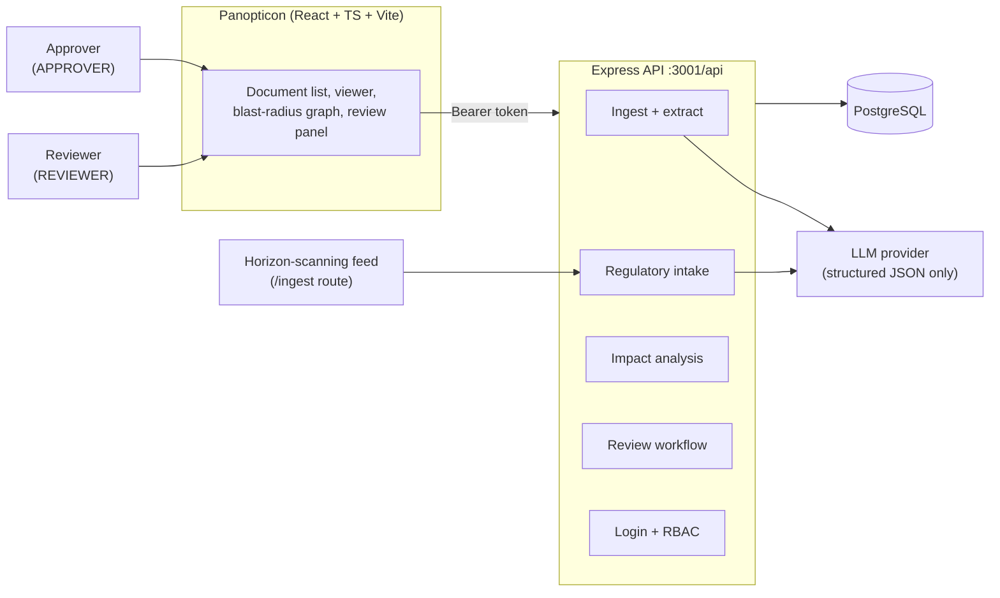
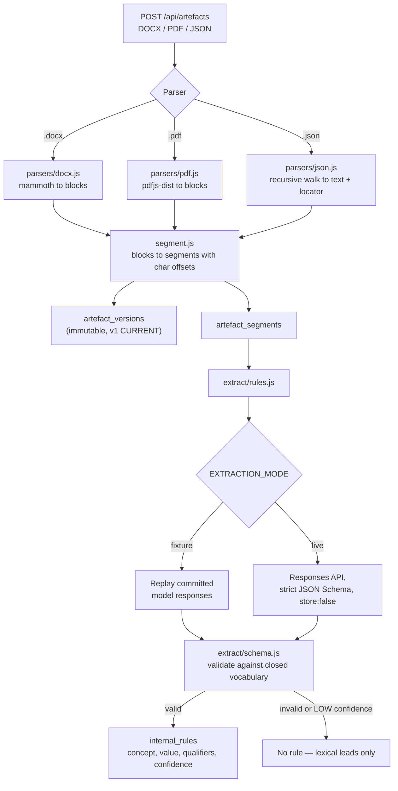
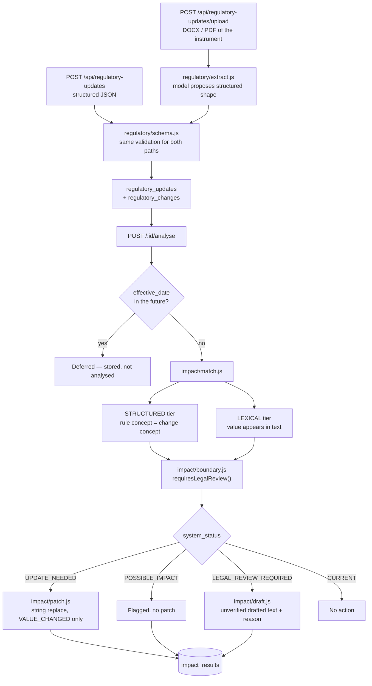
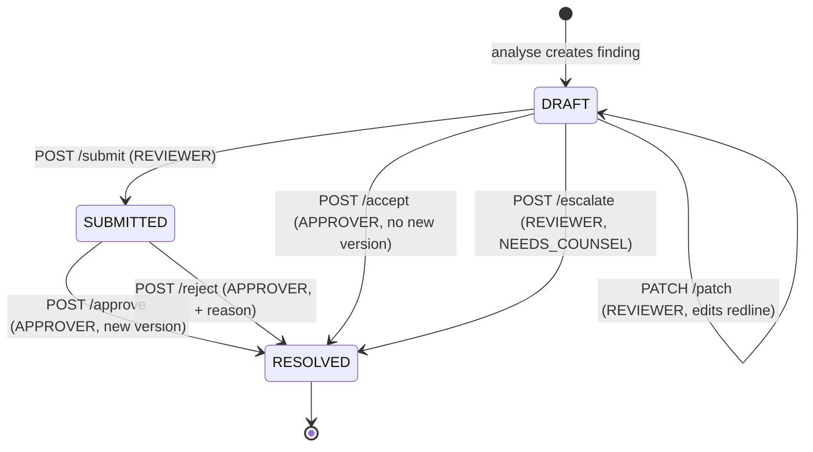
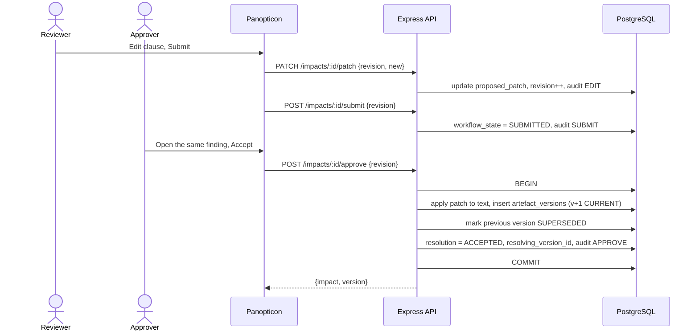
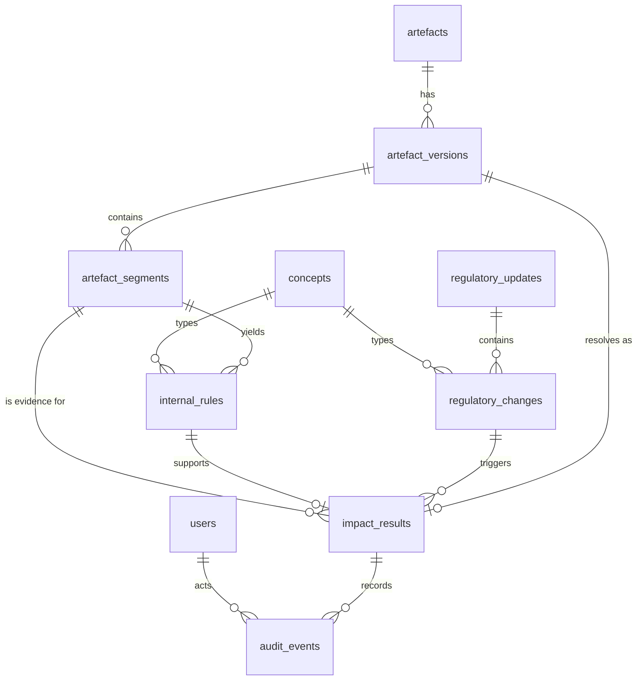

# Architecture

Diagrams generated from the code in this repository (`backend/src`, `backend/db/schema.sql`,
`frontend/src`). The canonical prose specification is [MVP_ARCHITECTURE.md](../MVP_ARCHITECTURE.md);
design decisions are in [IMPLEMENTATION.md](IMPLEMENTATION.md); the route contract is in
[API.md](API.md).

## 1. System context

The LLM is called only for claim extraction, regulatory-document reading, and unverified drafted
text. Matching, comparison, patching, statuses, versioning and RBAC are deterministic code.

## 2. Ingestion and extraction

## 3. Regulatory intake and impact analysis

`LEXICAL` evidence can never produce `UPDATE_NEEDED` — the database enforces it
(`lexical_never_definitive`). Historical statements and bare numbers produce no finding.

## 4. Review workflow and state machine

Every transition takes the caller's `revision` and writes an `audit_events` row. The approver may
never be the same user as `edited_by` or `submitted_by` — a database `CHECK`, not a UI rule.
Only `/approve` writes a new `artefact_versions` row and marks the previous one `SUPERSEDED`; a
trigger blocks any other mutation of an existing version. `/accept` resolves a finding that needs
no textual change and points at the version already current. Editing a patch resets the finding to
`DRAFT` and clears `submitted_by`, so a re-edit must be re-submitted.

## 5. Approval sequence

A stale `revision` is rejected, so two concurrent approvals cannot both write a version.

## 6. Data model

`artefact_versions`, `artefact_segments`, `internal_rules` and `audit_events` are append-only; the
`guard_immutable_records` trigger raises on any update other than `CURRENT` to `SUPERSEDED`.
`impact_results` is unique on `(change_id, segment_id)`, which makes re-analysis idempotent.
